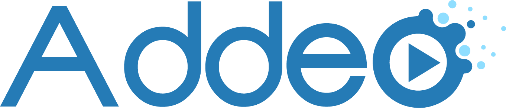

# Addeo

A Chrome extension to allow the addition of synchronized additive content 
to online videos.

## Quick Start for Developers

1. Clone this repository.
2. Open a Chromium browser (Chrome, Chromium, modern Edge...).
3. Go to your [Extensions](chrome://extensions) page.
4. Make sure Developer Mode is enabled.
5. Click the "Load unpacked" button.
6. Select [repo root]/src/addeo as the unpacked extension folder to load.
7. Ensure the Addeo extension is working with a [test video](https://www.youtube.com/watch?v=dQw4w9WgXcQ&addeo=dQw4w9WgXcQ&position=topleft). 
If the Addeo extension is working properly, you should see the video with a
synchronized picture-in-picture addeo in the top left.

## About This Project

Addeo is a Chrome extension to allow online videos to be augmented with 
third-party content distributed separately. We've coined the term *addeo* (a 
portmanteau of *addition* and *video*) to refer to this new type of medium.
Canonically, we can rephrase the first sentence of this paragraph to say that
Addeo is a Chrome extension which allows online videos to be augmented with 
addeos.

An addeo, more formally, is any kind of content which is *not* part of a 
certain video but for which said video is part of the intended context. For 
example, suppose a film studio produces a film and distributes it the on
Internet, but does not include Minbari subtitles. Minbari Ambassador Delenn 
watches this film, loves it, and wants to share it with her people, so she 
independently commissions the creation of Minbari subtitles. These subtitles 
are not part of the film or of the core suite of offerings distributed with 
it, but they are nonetheless intended to be consumed in the context of the 
film. Thus, these subtitles are an addeo.

At present (January 2021), distributing an addeo is not a simple or 
well-supported activity. Continuing with the example of Ambassador Delenn, if 
she wants to share these subtitles with her people, she has no good options 
and only a few bad ones: she could provide them as a transcript that Minbari 
viewers will have to read on their own, or she could create a separate video 
with just the subtitles that viewers will have to watch alongside the film, 
looking back and forth and manually synchronizing the times. Ideally, she 
would like to just be able to put her subtitles over the film in just the same 
way any other subtitles are overlaid, but because she does not own the film, 
she cannot simply duplicate it and put her subtitles on there.

This is the problem that the Addeo extension is intended to solve. Addeo is 
able to take independent, separately-distributed content and synchronize it at 
display time so that it can be viewed in proper context of the video for which 
it was created. Ambassador Delenn can simply format her subtitles as an addeo 
that the extension can understand, then instruct viewers to install the Addeo
extension on the browser in which they want to watch the film. Viewers will 
then be able to watch the film on its original, intended viewing site, and the
addeo subtitles will be automatically synchronized and displayed on top of the 
video much as subtitles provided by the film's creators would be.

It's worth noting that subtitles are not the only kind of content that can be
distributed as an addeo; almost anything that adds onto a video can be done
this way.

- Subtitles
- Dubs
- Accessibility features (high-contrast overlay, descriptive narration for the 
blind, etc.)
- Commentary (watch-along critique, reaction videos, educational explanations, 
etc.)
- Alternative soundtracks
- ...

A more in-depth discussion of the motivation behind this project can be found
[here](doc/Motivation.md).

## License

This repository is made available under the terms of the 
[MIT License](LICENSE). 

Exceptions to this include the [logo](assets/addeo_logo.png) and 
[icon](src/addeo/img) assets, which are governed by the 
[CC BY-NC-ND 4.0](https://creativecommons.org/licenses/by-nc-nd/4.0/) license 
as described in the assets [LICENSE](assets/LICENSE) file. (NOTE: This more 
restrictive license for logo and icons was chosen as a default, because I do 
not know of a legitimate reason someone would want to modify and redistribute 
a logo or icon. If you have a reason you would like this asset license 
changed, please open a GitHub issue and I'll be happy to discuss it.)
