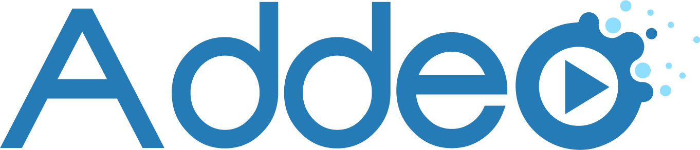

# For Content Creators

Welcome, and thanks for checking out Addeo! This page is specifically intended 
to help content creators quickly get a high-level understanding of what Addeo 
is and what it might be able to do for you.

Addeo is specifically intended to help creators who make *additive content* --
that is, content which adds something to other existing content, or *primary* 
content. Additive content includes things like watch-along critique, reaction 
videos, alternative subtitles, language dubs, and so on.

Typically, making and distributing additive content today requires the content 
creator to replicate and redistribute some or all of the primary content. For 
example, reaction videos almost always include clips cut out from the primary 
content, such as a feature film. This unfortunately puts additive content 
creators at risk of having their content summarily taken down, and it can make 
it difficult to monetize additive content as well.

## What is Addeo?

At a high level, you can think of Addeo as a tool for putting one video on 
top of another at *view* time, not at *editing* time. The key thing this 
enables is a new way of distributing additive content: you can distribute it 
by itself now, separate from the content it's supposed to add to, and viewers 
who have access to both the primary content and the additive content can still 
view both together, exactly as though they're viewing an edited video.

For example, imagine you wanted to create a critique or reaction video for a 
feature film. To do this, you might take video content from the feature film 
and put a video ofyourself on top of it, then upload the combined footage to 
YouTube. However, uploading footage taken from a feature film to YouTube is 
risky, and you might have to work with some pretty tight constraints to avoid 
having your content flagged and taken down.

But what if, instead of uploading the combined footage, you could upload and
distribute *only your part* -- only your reactions, for example -- and viewers 
could still watch what is effectively a reaction video by watching your 
reactions at the same time as they watch the original video? What if, in fact, 
your video could effectively have transparency, and there were a way for users
to view your additive content *on top of and synchronized with* the video 
your content is about? That way, viewers could get the same kinds of viewing 
experiences they're used to, but content creators like you wouldn't have to
upload any copyrighted content that might put them at risk.

That's exactly what Addeo does. Instead of having to take pieces (or all) of 
the primary content in order to make additions to it, Addeo allows you to 
distribute your additions *on their own*, which viewers can then watch on
top of the primary content directly.

## Who Is Addeo Good For?

- **It's good for additive content creators** because it frees the medium of 
*addeos* -- additive content for videos -- from a lot of risks and 
constraints. Because you're never distributing anything you didn't directly
create, your content itself is now unambiguously your own, and you shouldn't 
have to worry about things like length and screen time, freeing you to create
without constraint in a way that's never been possible for additive content 
before.
- **It's good for primary content creators** because it allows additive 
content to help drive consumption of the primary content itself. If someone 
creates an addeo reacting to *The Wizard of Oz*, that creators viewers are 
then more likely to rent *The Wizard of Oz* on Amazon (or wherever) so that 
they can watch the addeo along with it.
- **It's good for content platforms** because content platforms want content,
and if content can be recombined and redistributed without anybody needing to 
copy or take down anything, that opens up a whole new world of content for 
platforms to host and serve.

## Who Is Addeo *Not* Good For?

Honestly, I have no idea. Content takedown enthusiasts, maybe? Is that a thing?

## How Do I Get Started Making Addeos?

Addeo is a very young project, and we'd love to talk directly to you if you're 
interested in learning more! With that in mind, the best way to get started 
with Addeo right now is to reach out to us with an @ or a PM on 
[Twitter](https://twitter.com/addeodev), where we'd love to chat with you 
and learn more!

Longer-term, our goal is to make the Addeo creation process *at least* as 
easy as editing a normal video; easier, if we can. You can already make simple 
Addeos by just making normal videos with specific characteristics (a 
solid-color background to be chroma-keyed, an assumption that the whole video 
will be picture-in-picture, etc.) and distribute those through YouTube; for an 
example of what this might look like, check out our 
[Addeo v0.0.1 demo video](https://www.youtube.com/watch?v=E_JbAx8x0aU).

## So What Should I Do Next?

Definitely ping us on [Twitter](https://twitter.com/addeodev)!
